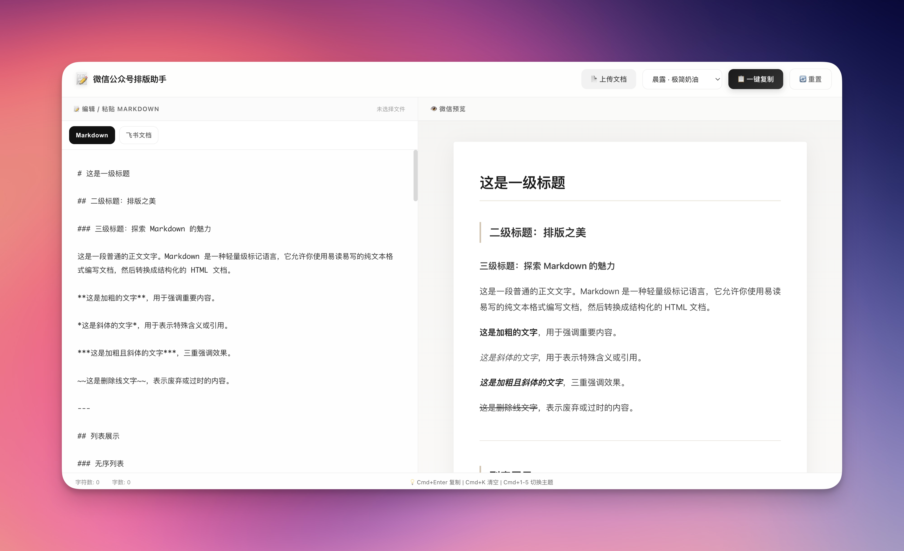

# ✨ 微信公众号排版助手

> 快速上手的微信公众号排版工具，内置 **9 款**精选设计主题，让每一篇文章都成为视觉享受。


---

## 📸 预览截图

### 界面预览



*主界面：左侧编辑，右侧实时预览*

---

## 📚 文档导航

- 📖 [完整产品文档](docs/PRODUCT_DOCUMENTATION.md) - 详细功能说明和使用指南
- ⚡ [快速上手](docs/QUICK_START.md) - 5 分钟快速开始
- 🔧 [开发者指南](docs/DEVELOPER_GUIDE.md) - 技术架构和 API 文档

---

## 🎨 设计主题（9 款）

### 经典主题（3 款）

| 主题 | 风格 | 适合场景 |
|------|------|----------|
| **晨露** · 极简奶油 | 温暖柔和，大地色系，圆润质感 | 生活方式、随笔、情感类 |
| **都市** · 杂志编辑 | 黑白对比，荧光标记，强烈层次 | 商业、科技、时尚类 |
| **森系** · 自然治愈 | 森林绿意，有机圆角，温暖木质 | 旅行、生活、环保类 |

### 特色风格（6 款）

- 🏮 **国潮** · 新中式 - 中国传统色彩 + 现代排版
- 🎋 **侘寂** · 日式极简 - 不完美美学
- 🎞️ **胶片** · 复古怀旧 - 暖色调、颗粒感
- ✏️ **手绘** · 插画风格 - 手写字体、涂鸦边框
- 🌸 **清新** · 文艺自然 - 粉嫩配色、花朵元素
- 🏭 **工业** · 硬核机能 - 金属质感、黄黑配色

---

## ✨ 核心功能

- 📄 **多格式输入** - Markdown / Word (.docx) / 飞书文档直接粘贴
- 📝 **实时预览** - 左侧编辑，右侧即时渲染微信样式
- 🎨 **9 款设计主题** - 覆盖常见内容风格，一键切换
- 📋 **一键复制** - 粘贴到公众号，格式 100% 保留
- 🚀 **飞书文档支持** - 直接复制飞书/语雀文档，图片自动保留
- ⌨️ **快捷键支持** - `Cmd+Enter` 复制、`Cmd+K` 清空、`Cmd+1~5` 切换主题
- 📊 **字数统计** - 实时显示字符数与字数

---

## 🚀 快速开始

```bash
# 1. 进入项目目录
cd Layout_assistant

# 2. 启动本地服务器
python3 -m http.server 8888

# 3. 浏览器访问
open http://localhost:8888

# 4. 开始创作！
```

⚠️ **注意**：复制功能需要使用 `navigator.clipboard` API，必须在 `localhost` 或 `https` 环境下运行。

---

## 📝 使用流程

1. **输入内容** - 在左侧编辑器输入 Markdown，或直接粘贴飞书文档
2. **选择主题** - 从 9 款设计主题中选择最适合的风格
3. **实时预览** - 右侧即时显示微信样式效果
4. **一键复制** - 点击"📋 一键复制"或按 `Cmd+Enter`
5. **粘贴发布** - 在公众号编辑器中粘贴，格式完美保留

💡 **详细使用指南**：[快速上手文档](docs/QUICK_START.md)

---

## 🎯 设计亮点

### 留白与呼吸感
- 大段落间距 (1.8-2.0 行高)
- 充足的边距与内边距
- 视觉层次清晰

### 精致的细节
- 圆角引用框 (12-16px)
- 渐变分割线
- 荧光笔标记效果 (都市主题)

### 色彩和谐
- 晨露：奶油色系 #faf8f5 + 大地棕 #8b7355
- 都市：纯黑 #000 + 荧光黄 #ffeb3b
- 森系：森林绿 #4a7c59 + 暖木色
- 国潮：红金点缀 + 现代留白

---

## 🛠️ 技术栈

| 技术 | 版本 | 用途 |
|------|------|------|
| **前端框架** | 原生 JavaScript (ES6+) | 核心逻辑 |
| **Markdown 解析** | marked.js 9.1.6 | Markdown → HTML |
| **Word 解析** | mammoth.js 1.6.0 | Word → HTML |
| **XSS 防护** | DOMPurify 3.0.6 | HTML 清理 |
| **剪贴板** | Clipboard API + clipboard.js | 复制功能 |
| **代码高亮** | highlight.js 11.9.0 | 代码块高亮 |

---

## 📁 项目结构

```
Layout_assistant/
├── index.html              # 主页面
├── css/
│   └── style.css          # 样式文件
├── js/
│   ├── app.js             # 核心应用逻辑
│   └── themes.js          # 主题配置
├── docs/                  # 文档目录
│   ├── PRODUCT_DOCUMENTATION.md
│   ├── QUICK_START.md
│   ├── DEVELOPER_GUIDE.md
│   └── ...
├── tests/                 # 测试文件
└── README.md              # 项目说明
```

---

## 🔧 本地开发

```bash
# 1. 克隆项目
git clone https://github.com/your-username/Layout_assistant.git
cd Layout_assistant

# 2. 启动本地服务器
# 使用 Python
python3 -m http.server 8888

# 或使用 Node.js
npx http-server -p 8888

# 3. 浏览器访问
open http://localhost:8888
```

---

## 📊 浏览器兼容性

| 浏览器 | 最低版本 | 状态 |
|--------|---------|------|
| Chrome | 66+ | ✅ 完全支持 |
| Safari | 13.1+ | ✅ 完全支持 |
| Firefox | 63+ | ✅ 完全支持 |
| Edge | 79+ | ✅ 完全支持 |
| IE 11 | - | ❌ 不支持 |

---

## 🌟 功能亮点

- ✨ **9 款精美主题** - 涵盖各种场景和风格
- ⚡ **实时预览** - 输入即渲染，无延迟
- 🎨 **100% 格式保留** - 内联样式，完美兼容微信
- 🚀 **飞书/语雀支持** - 直接粘贴，图片自动保留
- 📝 **Word 文档支持** - 上传 .docx 文件，自动转换
- ⌨️ **丰富的快捷键** - 提升操作效率
- 📱 **响应式设计** - 自适应不同屏幕尺寸
- 🔒 **安全可靠** - 本地运行，数据不上传

---

## 📄 License

本项目采用 MIT 协议开源 - 详见 [LICENSE](LICENSE) 文件

---

## 🤝 贡献指南

欢迎提交 Issue 和 Pull Request！

1. Fork 本项目
2. 创建特性分支 (`git checkout -b feature/AmazingFeature`)
3. 提交更改 (`git commit -m 'Add some AmazingFeature'`)
4. 推送到分支 (`git push origin feature/AmazingFeature`)
5. 开启 Pull Request

---

## 📞 支持与反馈

- 📖 [完整文档](docs/INDEX.md)
- 🐛 [问题反馈](https://github.com/your-username/Layout_assistant/issues)
- 💡 [功能建议](https://github.com/your-username/Layout_assistant/issues)

---

## ⭐ Star History

如果这个项目对你有帮助，请给个 Star 支持一下！

---

## 🎯 路线图

- [ ] 支持更多文档格式（PDF、TXT）
- [ ] 添加更多主题样式
- [ ] 支持自定义主题
- [ ] 添加图片上传和管理功能
- [ ] 支持导出为 HTML 文件

---

Designed with ❤️ for Content Creators
